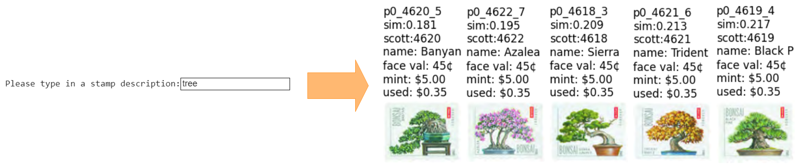
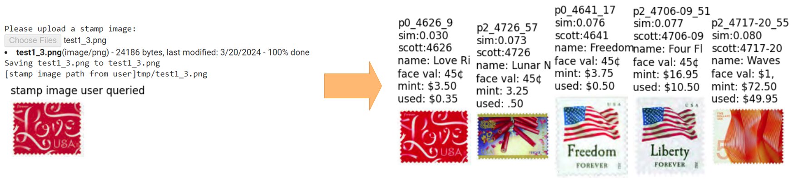
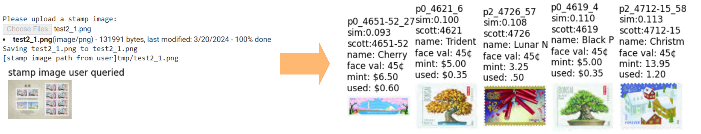
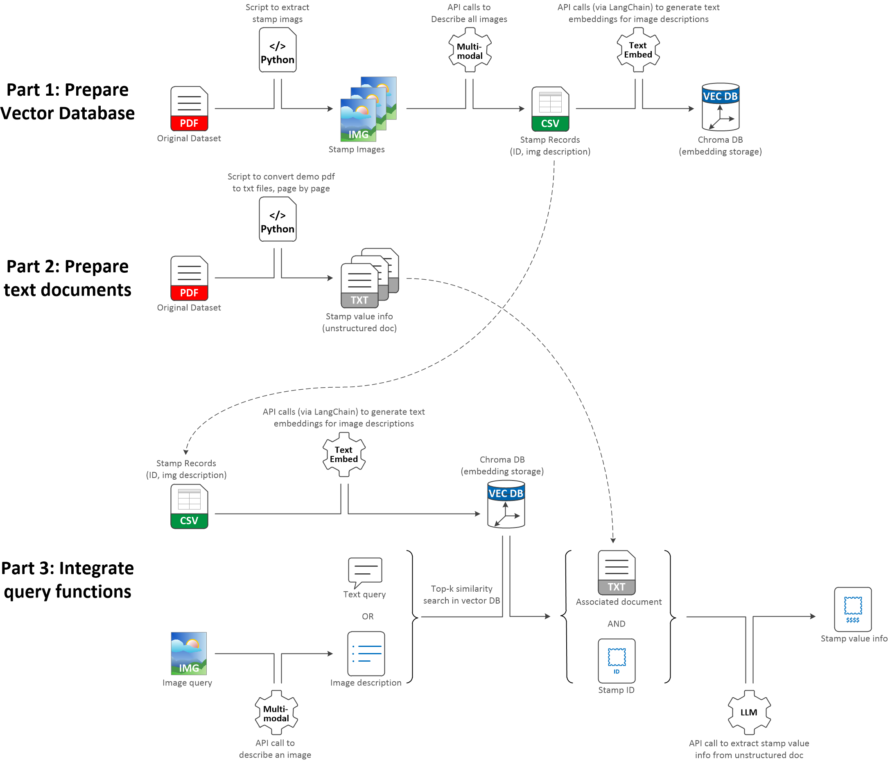

# PhilaScout 

PhilaScout is a Retrieval-Augmented Generation (RAG) project designed primarily for educational purposes. As indicated by its name, the core functionality of this project is to provide information on stamp values when queried either through a text description or an image of the stamp.

This project leverages a multi-modal model to interpret images, a text-embedding model to transform image descriptions into embeddings, and a large language model (LLM) to extract stamp value information from unstructured documents. The current implementation utilizes OpenAI's vision model, embedding model, and large language model to simplify the process and ensure high-quality results. However, the use of OpenAI's models is not mandatory; users may opt to integrate other vision models, embeddings, and LLMs -- the fundamental idea and workflow remain the same.

Furthermore, the scope of the project can be extended beyond stamp recognition. By selecting different datasets, this application can be adapted to various user scenarios, such as offering shopping recommendations on e-commerce websites based on text searches reflecting user needs or product images previously clicked by the user, or enhancing inventory management in warehouses, enabling staff to identify unknown items through item descriptions or image scans.

## Overview

PhilaScout offers two main user scenarios:

**Scenario 1: Text Query** - Users can enter a description of a stamp, and the application will display matching stamps along with their value information.

**Scenario 2(a): Known Image Query** - Users can upload an image of a stamp that already has its embedding stored in the vector database. The application then shows matching stamps with value details.

**Scenario 2(b): Unseen Image Query** - Users can upload an image of a stamp not previously seen by the application; the application returns similar stamps with their respective values.

In each scenario, whether the query is text-based or image-based, the application will return the most relevant stamps (by default: five) along with their value information.

## Project Architecture

This application is composed of three main parts, as illustrated below:

**Part 1:** Focuses on preprocessing the raw dataset and preparing a vector database (ChromaDB) for similarity searches. This stage sets the foundation for retrieving the most relevant stamp records based on user queries.

**Part 2:** Concentrates on preparing text files for querying stamp value information. This preparation enables the extraction of stamp value information during user queries.

Both Part 1 and Part 2 are designed to prepare components for the next phase and are considered a one-time effort.

**Part 3:** Integrates all components from previous parts to perform final user text and image queries. This final phase involves the integration and testing of all components, ensuring that all user scenarios are effectively covered.

## Implementation Details

### Dataset

The required raw dataset is a stamp catalog pdf from the Mystic Stamp Company. You can download it by visiting their website at [https://catalog.mysticstamp.com/](https://catalog.mysticstamp.com/) and clicking the 'Download Pdf file' button. The full catalog is quite extensive, comprising 164 pages. For demonstration purposes, we have only randomly selected 3 pages to serve as our sample dataset. Feel free to select any pages that interest you the most and expand your demonstration dataset accordingly in your implementation.

<small><i>Please note that USPS stamp images are copyrighted materials owned by the USPS. You may need to request permission for uses beyond educational purposes.</i></small>

### Google Colab Environment Setup

To simplify the implementation, Parts 1, 2, and 3 are all coded in Jupyter notebooks within the Google Colab environment. To reproduce these parts by yourself, don’t forget to set your 'OpenAI API key' in 'Colab Secrets'. This key is crucial for making direct OpenAI API calls, necessary for describing stamp images and extracting stamp value information from text documents. Additionally, the 'OpenAI API key' is used by LangChain to make OpenAI embedding API calls, which convert stamp image descriptions into OpenAI embeddings before storing them in the vector database.

### API Call Cost

As of April 2024, the pricing for using the GPT-4-turbo-2024-04-09 model is $10.00 per million input tokens and $30.00 per million output tokens. The cost for using the Text-embedding-ada-002-v2 model is $0.10 per million tokens, which is much cheaper and thus can be considered negligible.

In our project, there are three types of API call costs:
1) **Multi-modal model (GPT-4-turbo-2024-04-09) for describing stamp images:** Approximately $0.01 per image description.
2) **LLM (GPT-4-turbo-2024-04-09) for extracting stamp value information from text documents:** Roughly $0.02 per extraction.
3) **Text embedding model (Text-embedding-ada-002-v2) to convert stamp image descriptions into embeddings for the vector database:** The cost is negligible.

**Cost Summary:**
- **Part 1:** Using the multi-modal model to describe all stamp images from the year 2012 (approximately 60 images) incurred a one-time cost of $0.52.
- **Part 3:** For any text query, returning the five most relevant stamps along with their value information, the cost is about $0.10 per query. For any image query, an additional $0.01 is required to describe the query image, resulting in a total of $0.11 per image query.

## References

This project was inspired by a variety of public resources available on the internet. Below is a list of some key resources:

1. **Sam Witteveen's YouTube video for LangChain retrieval with ChromaDB:** [LangChain Retrieval QA Over Multiple Files with ChromaDB](https://youtu.be/3yPBVii7Ct0?si=8az1366RN6jX74Hm)

2. **Suresh R's Medium blog for image similarity search using embedding:** [Revolutionizing Image Search with GPT-4 Vision](https://medium.com/@sureshraghu0706/revolutionizing-image-search-with-gpt-4-vision-e1fc36fca7e8)

3. **Johnny Code's YouTube video for image embedding search in ChromaDB:** [Get Started with ChromaDB Multimodal Image Embeddings Search](https://youtu.be/u_N1t0CBuqA?si=Oiu7xXTVtq1QAik)

4. **OpenAI official documentation:** [OpenAI GPT-4 Vision Model Guide](https://platform.openai.com/docs/guides/vision)

5. **LangChain official documentation:** [ChromaDB Usage Guide](https://python.langchain.com/docs/integrations/vectorstores/chroma/)

6. **Chroma official documentation:** [Define Distance Function in Chroma](https://docs.trychroma.com/usage-guide#changing-the-distance-function)

7. **Mystic Stamp Company’s stamp catalog:** [Stamp Catalog](https://catalog.mysticstamp.com)

Additionally, ChatGPT has been used during project development to assist with code snippet search and document proofreading.

## Ethical Use Policy

Although this software is released into the public domain and is free from any restrictions under [CC0](./LICENSE), we encourage responsible and ethical use. Please review our [Ethical Use Guidelines](./ETHICS.md) to understand the values and principles we hope will guide users of this software.

We believe adherence to these guidelines will help ensure that the software is used in ways that are beneficial and fair. Thank you for respecting these principles.

